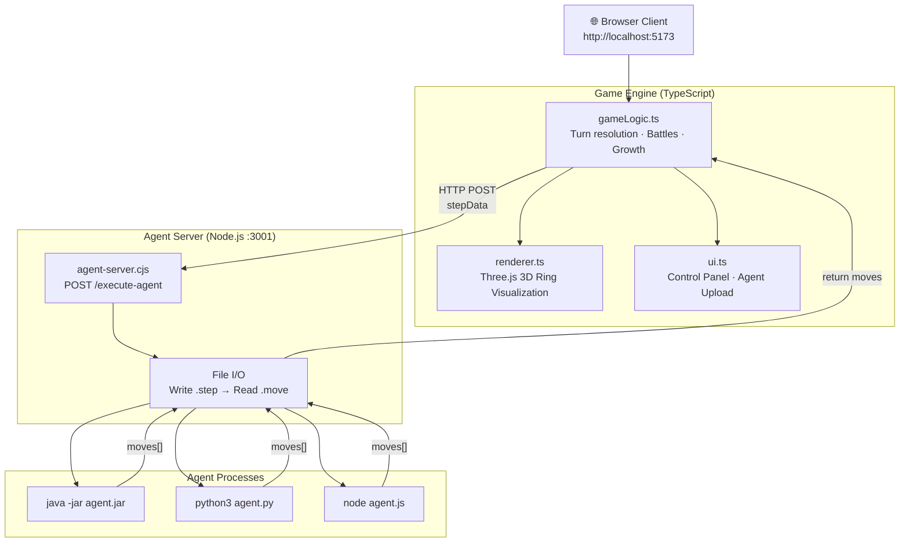
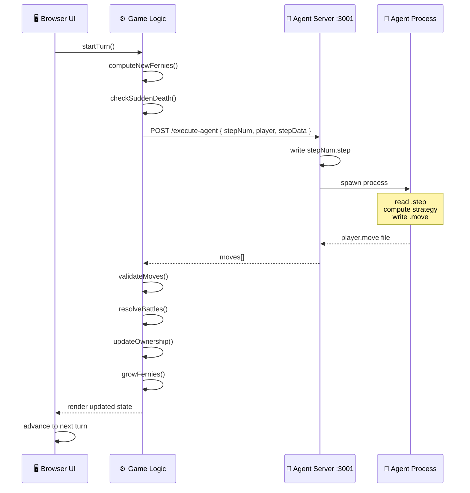
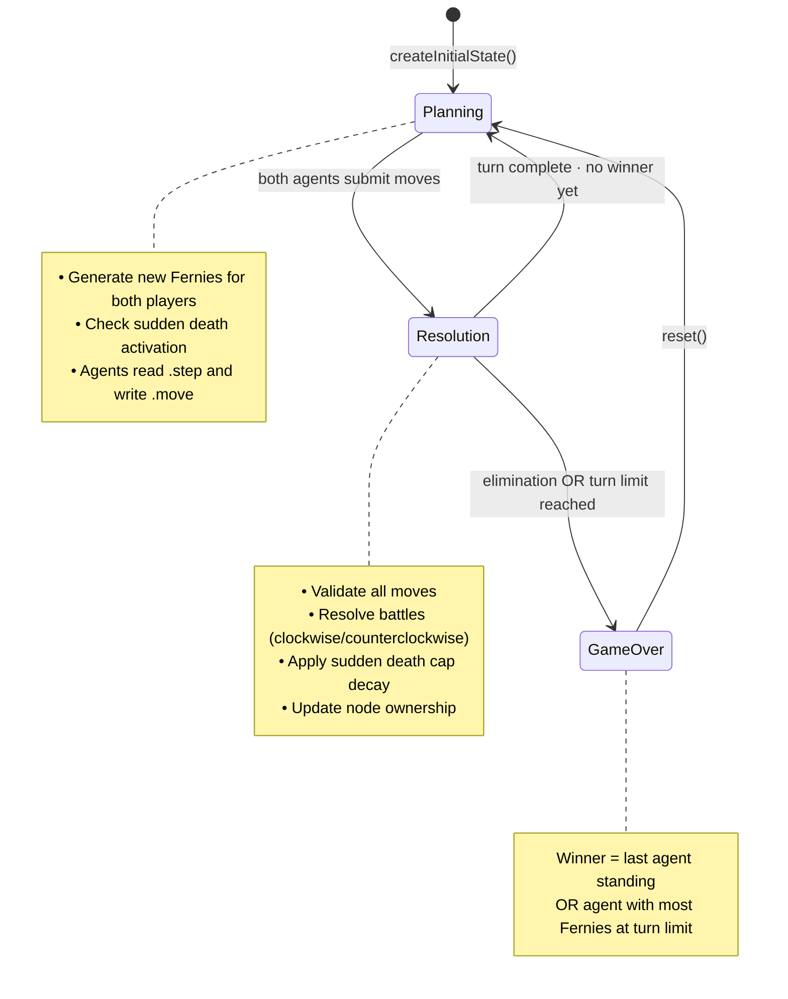
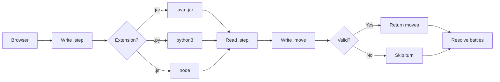

<div align="center">

# 🎮 RINGwars 3D

### *Write an AI agent. Watch it fight for territory on a 3D ring battlefield.*

[](https://github.com/Anirach/ringwars3d)
[](LICENSE)
[](https://nodejs.org)
[](https://threejs.org)
[](https://typescriptlang.org)
[](https://vitejs.dev)

**A browser-based AI competition platform — two agents battle on a 20-node 3D ring.  
Write your strategy in Java, Python, or JavaScript and let it fight.**

[Quick Start](#-quick-start) · [How It Works](#%EF%B8%8F-how-it-works) · [Build an Agent](#-build-your-ai-agent) · [Game Rules](#-game-rules) · [Full Manual](MANUAL.md)

</div>

---

## ✨ Features

- **20-node circular ring battlefield** visualized in real-time 3D with Three.js
- **Multi-language AI agents** — upload Java `.jar`, Python `.py`, or Node.js `.js`
- **Fog of war** — agents only see nodes within their `visibilityRange`
- **Fernie growth economy** — units grow each turn based on territory held
- **Sudden death** — max Fernies per node decays after a configurable turn threshold
- **Three battle types** — Local, Edge, and Triple node conflict resolution
- **Configurable parameters** — turn limit, growth rate, decay, visibility, and more
- **Built-in example agents** — aggressive, defensive, expansion, and balanced strategies

---

## 🚀 Quick Start

**Requirements:** Node.js ≥ 18 · npm · Chrome / Edge / Firefox

```bash
# 1. Clone and install
git clone https://github.com/Anirach/ringwars3d.git
cd ringwars3d
npm install

# 2. Start game server (Terminal 1)
npm run dev              # → http://localhost:5173

# 3. Start agent server (Terminal 2) — required for AI agent execution
npm run agent-server     # → http://localhost:3001
```

Open **http://localhost:5173** in your browser.

---

## ⚙️ How It Works

### System Architecture



---

### Turn Sequence



---

### Game State Machine



---

### Agent Execution Flow



---

## 🤖 Build Your AI Agent

### Supported Languages

| Language | File | Command |
|---|---|---|
| **Java** | `.jar` | `java -jar agent.jar <stepNum> <playerName>` |
| **Python** | `.py` | `python3 agent.py <stepNum> <playerName>` |
| **Node.js** | `.js` | `node agent.js <stepNum> <playerName>` |

---

### Input — `<stepNum>.step`

```
10,15,-1,20,8,0,5,12,-1,3,0,0,7,4,-1,0,0,9,6,0
Y,Y,H,N,U,U,N,N,H,U,U,U,N,N,H,U,U,N,Y,U
25
10000
```

| Line | Content | Values |
|---|---|---|
| **Line 1** | Fernie count per node | Integer · `-1` = hidden (fog of war) |
| **Line 2** | Node owner per node | `Y`=you · `N`=enemy · `U`=neutral · `H`=hidden |
| **Line 3** | New Fernies available this turn | Integer |
| **Line 4** | Current max Fernies per node | Integer (decreases in sudden death) |

> Nodes are ordered `0` → `ringSize-1`. Node `0` is adjacent to node `1` and node `ringSize-1`.

---

### Output — `<playerName>.move`

```
5,20
3,10
```

Each line = `nodeIndex,amount` — place `amount` Fernies on node `nodeIndex`.

> **Rules:** total placed ≤ Line 3 · target node must be owned or adjacent to owned node · partial moves are accepted.

---

### Agent Starter Templates

<details>
<summary><b>Python Template</b></summary>

```python
#!/usr/bin/env python3
import sys

def parse_step(step_num):
    with open(f"{step_num}.step") as f:
        lines = f.read().strip().split('\n')
    fernies  = list(map(int, lines[0].split(',')))
    owners   = lines[1].split(',')     # Y / N / U / H
    new_f    = int(lines[2])           # Available Fernies to place
    max_cap  = int(lines[3])           # Current node cap
    return fernies, owners, new_f, max_cap

def compute_moves(fernies, owners, new_f):
    moves = []
    my_nodes = [i for i, o in enumerate(owners) if o == 'Y']
    if not my_nodes:
        return moves
    per_node = new_f // len(my_nodes)
    for node in my_nodes:
        if per_node > 0:
            moves.append(f"{node},{per_node}")
    return moves

step_num = sys.argv[1]
player = sys.argv[2]
fernies, owners, new_f, max_cap = parse_step(step_num)
moves = compute_moves(fernies, owners, new_f)

with open(f"{player}.move", 'w') as f:
    f.write('\n'.join(moves))
```

</details>

<details>
<summary><b>Node.js Template</b></summary>

```javascript
#!/usr/bin/env node
const fs = require('fs');

const stepNum = process.argv[2];
const player = process.argv[3];

// Parse step file
const content = fs.readFileSync(`${stepNum}.step`, 'utf-8');
const lines = content.trim().split('\n');
const fernies = lines[0].split(',').map(Number);
const owners = lines[1].split(',');        // Y / N / U / H
const newFernies = parseInt(lines[2], 10); // Available to place
const maxCap = parseInt(lines[3], 10);     // Current max per node

// Strategy: distribute evenly across owned nodes
const myNodes = owners.map((o, i) => o === 'Y' ? i : -1).filter(i => i >= 0);
const moves = [];
if (myNodes.length > 0) {
    const perNode = Math.floor(newFernies / myNodes.length);
    for (const node of myNodes) {
        if (perNode > 0) moves.push(`${node},${perNode}`);
    }
}

// Write move file
fs.writeFileSync(`${player}.move`, moves.join('\n'));
```

</details>

<details>
<summary><b>Java Template</b></summary>

```java
import java.io.*;
import java.util.*;

public class Agent {
    public static void main(String[] args) throws IOException {
        String stepNum = args[0];
        String player = args[1];

        // Parse step file
        BufferedReader reader = new BufferedReader(new FileReader(stepNum + ".step"));
        int[] fernies = Arrays.stream(reader.readLine().split(",")).mapToInt(Integer::parseInt).toArray();
        String[] owners = reader.readLine().split(",");  // Y / N / U / H
        int newFernies = Integer.parseInt(reader.readLine());
        int maxCap = Integer.parseInt(reader.readLine());
        reader.close();

        // Strategy: distribute evenly across owned nodes
        List<Integer> myNodes = new ArrayList<>();
        for (int i = 0; i < owners.length; i++) {
            if (owners[i].equals("Y")) myNodes.add(i);
        }

        List<String> moves = new ArrayList<>();
        if (!myNodes.isEmpty()) {
            int perNode = newFernies / myNodes.size();
            for (int node : myNodes) {
                if (perNode > 0) moves.add(node + "," + perNode);
            }
        }

        // Write move file
        PrintWriter writer = new PrintWriter(player + ".move");
        for (String move : moves) writer.println(move);
        writer.close();
    }
}
```

> Compile: `javac Agent.java` → Package: `jar cfe agent.jar Agent Agent.class`

</details>

---

### Example Agents (in `server/agents/`)

| Agent | Language | Strategy |
|---|---|---|
| `aggressive_agent.py` | Python | Always attack the weakest enemy-adjacent node |
| `defensive_agent.py` | Python | Accumulate 2× opponent's force before striking |
| `expansion_agent.js` | Node.js | Rapid early-game neutral node capture |
| `balanced_agent.js` | Node.js | Phase-adaptive: expand → consolidate → attack |

---

### Upload & Run

1. Open **http://localhost:5173**
2. Click **Upload Agent** → select your `.jar` / `.py` / `.js`
3. Assign to **Red** or **Blue** in the dropdown
4. Click **Reset** → **Start Game**

---

## 🎯 Game Rules

### Fernie Growth

Each turn, each player receives new Fernies:

```
newFernies = ⌊totalOwnedFernies × growthPercent⌋
           + ⌊nodesControlled × nodeOwnershipBonus × totalOwnedFernies⌋
```

### Battle Resolution

| Battle Type | Trigger | Outcome |
|---|---|---|
| **Local** | Both agents place on the same node | Higher count wins · loser loses all Fernies |
| **Edge** | Opposing agents hold adjacent nodes | Larger force wins · survivor count = difference |
| **Triple** | Conflict spans 3+ consecutive nodes | Chain resolved in `resolutionDirection` order |

### Sudden Death

After `suddenDeathTurn`, the max Fernies cap decays each turn:

```
currentMaxFernies = currentMaxFernies - ⌊currentMaxFernies × suddenDeathDecay⌋
```

Nodes over the new cap lose excess Fernies — forcing aggressive play.

### Victory Conditions

| Condition | Winner |
|---|---|
| Opponent reaches 0 total Fernies | You |
| Turn limit reached — unequal Fernies | Most Fernies |
| Turn limit reached — equal Fernies | Draw |

### Default Settings

| Parameter | Default | Description |
|---|---|---|
| `ringSize` | `20` | Number of nodes on the ring |
| `startingFernies` | `75` | Initial Fernies per player |
| `growthPercent` | `10%` | Fernie growth per turn |
| `maxFerniesPerNode` | `10,000` | Hard cap per node |
| `visibilityRange` | `5` | Nodes visible from owned territory |
| `nodeOwnershipBonus` | `10%` | Extra growth per owned node |
| `turnLimit` | `200` | Max turns |
| `suddenDeathTurn` | `100` | Turn sudden death begins |
| `suddenDeathDecay` | `10%` | Cap reduction per turn in sudden death |

---

## 📁 Project Structure

```
ringwars3d/
│
├── src/
│   ├── ringwars/
│   │   ├── index.ts        # Game orchestrator: turn loop, AI execution, autoplay
│   │   ├── gameLogic.ts    # Rules: Fernie growth, battles, sudden death, .step/.move I/O
│   │   ├── renderer.ts     # Three.js: ring nodes, ownership colors, battle animations
│   │   ├── ui.ts           # Control panel: agent upload, settings, step/autoplay controls
│   │   └── types.ts        # Types: GameState, RingNode, Move, BattleResult, DEFAULT_SETTINGS
│   │
│   └── main-ringwars.ts    # Entry point
│
├── server/
│   ├── agent-server.cjs    # HTTP :3001 — receives agents, spawns processes, returns moves
│   └── agents/             # Example & competition agents (.py · .js · .jar)
│
├── index.html              # Game page
├── MANUAL.md               # Full user & developer documentation
├── vite.config.ts
└── package.json
```

---

## 🛠️ Development Commands

| Command | Description |
|---|---|
| `npm run dev` | Vite dev server → `http://localhost:5173` |
| `npm run agent-server` | Agent execution server → `:3001` |
| `npm run build` | Production build → `dist/` |
| `npm run preview` | Preview production build |

---

## 📄 License

MIT — see [LICENSE](LICENSE) · Full documentation: [MANUAL.md](MANUAL.md)

---

<div align="center">

Built with ❤️ by [Anirach](https://github.com/Anirach)

*Three.js · TypeScript · Vite · Node.js*

</div>
