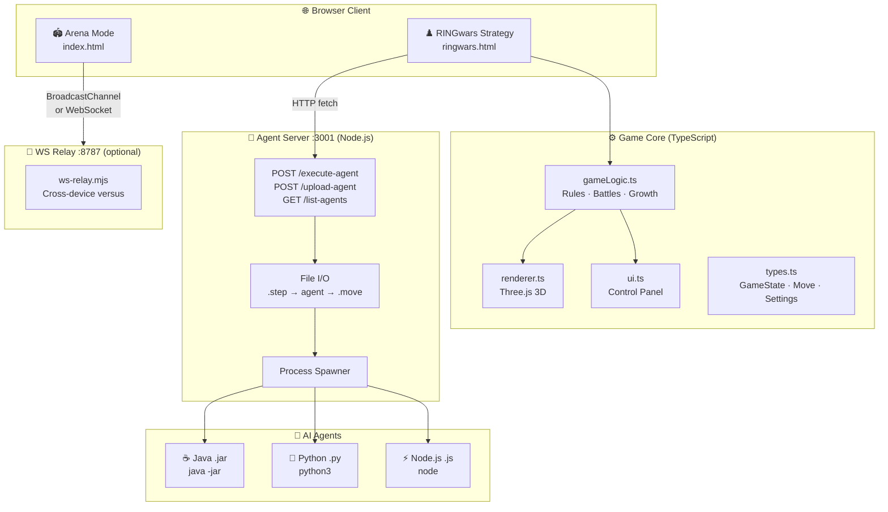
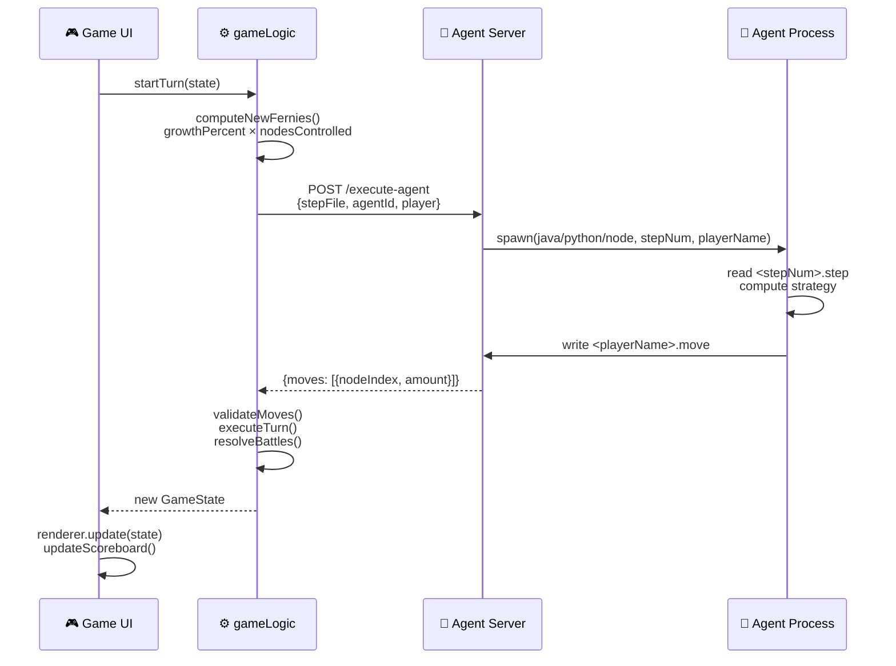
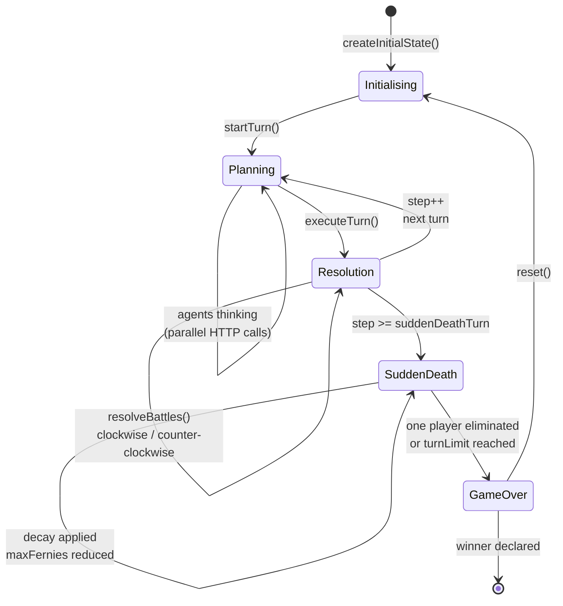
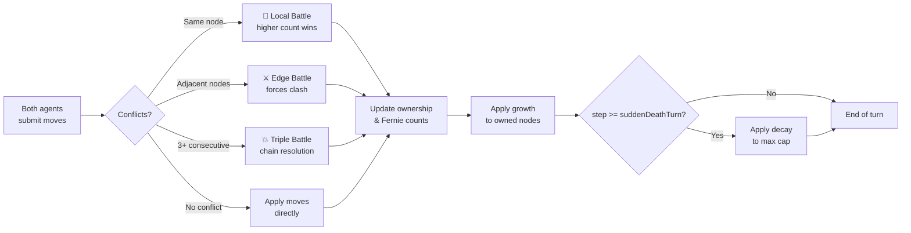

<div align="center">

# 🎮 RINGwars 3D

### *A browser-based AI strategy game where your code fights for territory on a 3D ring battlefield*

[](https://github.com/Anirach/ringwars3d)
[](LICENSE)
[](https://nodejs.org)
[](https://www.typescriptlang.org)
[](https://threejs.org)
[](https://vitejs.dev)

**Write an AI agent in Java, Python, or JavaScript — upload it — watch it battle.**

[Quick Start](#-quick-start) · [Architecture](#-architecture) · [Game Modes](#-game-modes) · [Build an Agent](#-build-your-ai-agent) · [Full Manual](MANUAL.md)

</div>

---

## 📐 Architecture

### System Overview



---

### Turn Lifecycle



---

### Game State Machine



---

### Battle Resolution Flow



---

## ✨ Features

<table>
<tr>
<th width="50%">♟️ RINGwars — Strategy Mode</th>
<th width="50%">🏟️ Arena — Action Mode</th>
</tr>
<tr>
<td>

- 20-node circular ring battlefield
- Red vs Blue AI agent competition
- **Fernie units** grow each turn based on territory
- Multi-language agent upload (Java / Python / JS)
- Fog of war — limited visibility range (default: 5)
- 3 battle types: Local, Edge, Triple
- Configurable: turn limit, sudden death, decay rate
- Real-time Three.js 3D visualization

</td>
<td>

- Third-person arena shooter
- Wave-based enemies: chaser, tank, spinner
- Boss battles every 5th wave (phase mechanics)
- Upgrade system: Shield / Burst AoE / Slow-time
- **Versus mode**: same machine (BroadcastChannel) or cross-device (WebSocket)
- Controller + touch + keyboard input
- 3 save slots with full progression persistence
- Configurable audio, camera, and controls

</td>
</tr>
</table>

---

## 🚀 Quick Start

**Requirements:** Node.js ≥ 18, npm, Chrome / Edge / Firefox

```bash
# 1. Clone and install
git clone https://github.com/Anirach/ringwars3d.git
cd ringwars3d
npm install
```

**♟️ RINGwars Strategy:**
```bash
npm run dev           # Terminal 1 — game server  → http://localhost:5173/ringwars.html
npm run agent-server  # Terminal 2 — agent server → port 3001
```

**🏟️ Arena Mode:**
```bash
npm run dev           # Open http://localhost:5173/
```

---

## 🎮 Game Modes

### ♟️ RINGwars — Turn-Based Strategy

A 20-node ring where two AI agents compete by deploying **Fernies** (units that grow based on controlled territory). Every turn: agents read game state → submit moves → battles resolve → growth applied.

#### Default Game Settings

| Parameter | Default | Range | Description |
|---|---|---|---|
| `ringSize` | `20` | 6–40 | Number of nodes on the ring |
| `startingFernies` | `75` | — | Initial Fernies per player |
| `growthPercent` | `10%` | — | Fernie growth rate per owned node |
| `visibilityRange` | `5` | — | Nodes visible from owned territory |
| `turnLimit` | `200` | 50–500 | Max turns before game ends |
| `suddenDeathTurn` | `100` | — | Turn when decay activates |
| `suddenDeathDecay` | `10%` | 5–30% | Max Fernies cap reduction per turn |
| `maxFerniesPerNode` | `10000` | — | Hard cap per node |

#### Battle Resolution Types

| Type | Trigger | Resolution |
|---|---|---|
| **Local** | Both players place on the same node | Higher Fernie count wins; loser loses all placed units |
| **Edge** | Opposing forces on adjacent nodes | Larger force survives with remainder; smaller eliminated |
| **Triple** | Conflict across 3+ consecutive nodes | Multi-node chain resolved clockwise or counter-clockwise |

---

### 🏟️ Arena Mode — Action

#### Controls

| Action | Keyboard | Gamepad |
|---|---|---|
| Move | `WASD` | Left stick |
| Aim | Mouse | Right stick |
| Fire | Left click | `RT` |
| Dash | `Space` | `A` |
| Shield | `F` | `LB` |
| Burst AoE | `Q` | `X` |
| Slow-time | `E` | `Y` |
| Weapon 1/2/3 | `1` / `2` / `3` | — |
| Pause | `Esc` | — |

#### Versus Mode Setup

```bash
# Option A — Same machine (2 browser tabs, no server needed)
http://localhost:5173/?mode=host&room=alpha     # Tab 1
http://localhost:5173/?mode=client&room=alpha   # Tab 2

# Option B — Cross-device (start relay server first)
node tools/ws-relay.mjs

http://<IP>:5173/?mode=host&room=alpha&ws=ws://<IP>:8787    # Host device
http://<IP>:5173/?mode=client&room=alpha&ws=ws://<IP>:8787  # Client device
```

> Open port `8787` in your firewall for cross-device play.

---

## 🤖 Build Your AI Agent

### Supported Languages

| Language | File | Command |
|---|---|---|
| **Java** | `.jar` | `java -jar agent.jar <stepNum> <playerName>` |
| **Python** | `.py` | `python3 agent.py <stepNum> <playerName>` |
| **Node.js** | `.js` | `node agent.js <stepNum> <playerName>` |

### Agent Input — `.step` file

```
10,15,-1,20,8,5,-1,-1,12,7,...    ← Fernie count per node (-1 = hidden by fog)
Y,Y,H,N,U,U,H,H,N,N,...          ← Node owner (Y=you  N=enemy  U=neutral  H=hidden)
25                                 ← New Fernies available to place this turn
10000                              ← Current max Fernies per node cap
```

### Agent Output — `.move` file

```
5,20    ← Place 20 Fernies on node 5
3,10    ← Place 10 Fernies on node 3
```

> Each line = one placement. Total placed ≤ new Fernies available (line 3).

### Minimal Python Agent

```python
import sys

step_num = sys.argv[1]
player   = sys.argv[2]

with open(f"{step_num}.step") as f:
    fernies   = list(map(int, f.readline().split(",")))
    ownership = f.readline().split(",")
    new_f     = int(f.readline())
    max_cap   = int(f.readline())

# Find neutral or enemy node adjacent to owned node and attack
my_nodes = [i for i, o in enumerate(ownership) if o.strip() == "Y"]

with open(f"{player}.move", "w") as f:
    for node in my_nodes:
        next_node = (node + 1) % len(fernies)
        if ownership[next_node].strip() in ("N", "U") and new_f > 0:
            amount = min(new_f, max_cap)
            f.write(f"{next_node},{amount}\n")
            new_f -= amount
            break
```

### Example Agents (included)

| File | Language | Strategy |
|---|---|---|
| `aggressive_agent.py` | Python | Attack weakest enemy node every turn |
| `defensive_agent.py` | Python | Build to 2× opponent before attacking |
| `expansion_agent.js` | Node.js | Rapidly capture neutral nodes early game |
| `balanced_agent.js` | Node.js | Phase-adaptive: expand → consolidate → attack |
| `RINGwars_*_Cornelia.jar` | Java | Student competition agent |
| `RINGwars_*_Vanessa.jar` | Java | Student competition agent |

### Upload Your Agent

1. Start both servers (`npm run dev` + `npm run agent-server`)
2. Open http://localhost:5173/ringwars.html
3. Click **Upload Agent** → select your file
4. Assign to **Red** or **Blue**
5. Click **Reset** → **Start Game** (or enable **Auto-Play**)

---

## 📁 Project Structure

```
ringwars3d/
│
├── src/
│   ├── ringwars/                   # ♟️ Strategy mode
│   │   ├── index.ts                #    Game orchestration, AI turn loop
│   │   ├── gameLogic.ts            #    Rules: growth, battle resolution, sudden death
│   │   ├── renderer.ts             #    Three.js ring & node 3D rendering
│   │   ├── ui.ts                   #    Control panel, agent upload UI
│   │   └── types.ts                #    GameState, Move, GameSettings interfaces
│   │
│   ├── entities/                   # 🏟️ Arena entity definitions
│   ├── systems/                    #    Arena game systems (physics, combat, AI)
│   │
│   ├── net/
│   │   ├── protocol.ts             #    Versus message schema
│   │   ├── transport.ts            #    BroadcastChannel / WebSocket abstraction
│   │   ├── versus.ts               #    Session management
│   │   ├── simClock.ts             #    Fixed-step simulation clock
│   │   ├── snapshot.ts             #    State snapshot ring buffer
│   │   └── prediction.ts           #    Client-side prediction & reconciliation
│   │
│   ├── core/
│   │   ├── state.ts                #    Global game state singleton
│   │   ├── input.ts                #    Unified keyboard/gamepad/touch input
│   │   ├── progression.ts          #    XP, levels, upgrades
│   │   ├── saveSlots.ts            #    LocalStorage persistence (3 slots)
│   │   ├── settings.ts             #    Audio, camera, control preferences
│   │   └── balance.ts              #    All tuning constants
│   │
│   ├── main-ringwars.ts            # ♟️ RINGwars entry point
│   └── main.ts                     # 🏟️ Arena entry point
│
├── server/
│   ├── agent-server.cjs            # Agent execution server (port 3001)
│   └── agents/                     # Example & competition agents
│
├── tools/
│   └── ws-relay.mjs                # WebSocket relay for cross-device versus (port 8787)
│
├── ringwars.html                   # RINGwars strategy page
├── index.html                      # Arena mode page
├── MANUAL.md                       # Full user & developer manual
├── vite.config.ts
└── package.json
```

---

## 🛠️ Development

| Command | Description |
|---|---|
| `npm run dev` | Start Vite dev server → `http://localhost:5173` |
| `npm run agent-server` | Start agent execution server → `:3001` |
| `npm run build` | Production build → `dist/` |
| `npm run preview` | Preview production build locally |
| `node tools/ws-relay.mjs` | Start WebSocket relay → `:8787` |

---

## 🔒 Production Checklist

The relay and agent server are intentionally minimal. For a production competition deployment:

- [ ] Authenticated sessions (JWT / OAuth)
- [ ] Authoritative server-side game simulation (prevent client manipulation)
- [ ] Anti-cheat: rate limits, impossible-delta detection, replay audit logs
- [ ] Input validation and sandboxing on all agent processes
- [ ] TLS (`wss://` + `https://`) behind a reverse proxy
- [ ] Persistent leaderboard and match history

---

## 🗺️ Roadmap

| Priority | Milestone |
|---|---|
| 🔴 High | Hardened multiplayer backend (auth + anti-cheat + persistence) |
| 🔴 High | Matchmaking / lobby UX + reconnection flow |
| 🟡 Medium | Expanded content (maps, bosses, weapons, audio) |
| 🟡 Medium | Agent sandbox isolation (Docker per agent process) |
| 🟢 Nice to have | QA / performance pass + telemetry |
| 🟢 Nice to have | Mobile optimization |

---

## 📄 License

MIT License — see [LICENSE](LICENSE) for details.  
Full documentation: [MANUAL.md](MANUAL.md)

---

<div align="center">

Built with ❤️ by [Anirach](https://github.com/Anirach)

*Three.js · TypeScript · Vite · Node.js*

</div>
